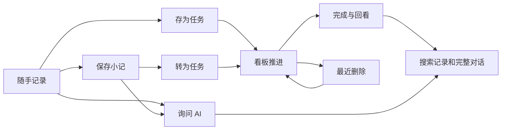

# Noto 端到端交互规范

2026-09-12 初版；2026-09-19 更新：任务同步、日历视图（⌘3）与屏幕边缘药丸已随 descope 提案移除，相关契约删除。本文为当前交互设计入口，历史 design 文档作为迭代与验收记录保留；冲突时以本文及本轮验收范围为准。

## 原始诉求与设计边界

已回看「调研 Mac 个人应用技术栈」「设计 AI 友好的任务看板模式」中的用户原话：每天小记与待办；本机 AI CLI 连续对话；原生 CLI + Skills 可写数据；苹果原生感；无横向白色顶栏；日期锚点默认收拢、可展开；视图用单图标原生菜单；任务轻量，只有普通/重要。后续请求延伸了任务日历与账号同步。

产品主线：**先记下来，需要时整理、推进、回看。** AI 是记录和任务上的操作方式。记录是共同时间线；看板按任务状态组织。两者共享同一条数据，不生成副本。

## Before / After

| Before | After | Why |
| --- | --- | --- |
| “笔记”列表实际混合笔记与任务 | 统一称“记录”，内容类型由待办控件表达 | 名称与数据范围一致 |
| 只有有历史对话的内容有 AI 入口 | 任意记录可从菜单发起讨论，右侧显示来源 | 不必复制内容另开笔记 |
| AI 使用内容随视图/搜索暗中变化 | 默认当前记录；可显式选择当前视图已载入内容 | 用户知道 AI 能看到、处理哪些数据 |
| 新输入存任务依靠快捷键或特殊前缀 | 保存菜单提供“存为任务”，仍以保存小记为主 | 不要求记住命令 |
| Mac 只能恢复最后一次删除 | “最近删除”持久可达，逐项恢复 | 删除恢复不依赖短暂提示 |

## 页面与状态契约

### 1. 进入与记录

默认恢复上次视图。记录列表按本地创建日期分组，日期锚点用于定位；⌘1/2 切换记录/看板。视图菜单只常驻一个图标。顶层无额外工具栏底色和分隔线。空态只解释如何开始，并给一个“写一笔”动作。已有数据时内容优先。

⌘N 或编写图标打开同一个浮动输入；空白双击就近打开。Enter 换行、⌘Enter 保存小记，保存旁的菜单可存为任务，询问 AI 为次级动作。收起保留进程内草稿，保存成功清空。未保存编辑阻止切视图/搜索；明确“放弃修改”和“保存”，不静默覆盖。

### 2. 整理和任务

记录菜单：编辑、转为任务/三态、与 AI 讨论/打开对话、复制；任务可删除。转为任务保留 ID、文字和对话。任务创建先写内容，再按需日期、重要；编辑时可改三态。新建取消是收起草稿，编辑取消是放弃修改，文案区分。

看板同一任务只在一个状态列。列内使用现有稳定排序；已完成先展示20条。窄屏允许横向滚动。拖动只改状态，菜单提供等价操作，不强迫拖拽。重要筛选生效时必须显式可清除。

### 3. 截止日期

任务日期是截止日，只有本地日历日期，没有指定时间提醒。今天/明天/自选/清除在同一个原生弹层。完成仍保留原截止日；修改日期不推断或改动状态、重要与完成时间，日期不按 UTC 换算。

### 4. AI

从内容菜单打开右侧对话，展示记录摘要；无历史时给简短下一步提示。默认上下文为当前记录，可从菜单切换到当前视图已载入的记录或筛选任务；显示准确数量，绝不标为全部历史。每轮同时使用该对话已有消息。CLI 选择仍仅在设置。

先保存问题，再执行 CLI。执行过程默认收起；运行/停止/失败/重试清晰。成功后回复与合法操作在同一事务保存，修改可撤销。用户列表只显示原记录文字，搜索包含完整历史。运行时仍可保存其他小记。AI 没有逐 token 流式输出，不用演示动画暗示流式能力。

### 5. 搜索和回看

搜索记录及历史对话；任务视图搜索所有任务，记录视图分页加载匹配结果。筛选作用域随当前视图明确，切换视图清空搜索。无结果提供清除。修改记录文字不改历史问答。恢复后保留原始任务属性和该设备归档的对话。

### 6. 恢复

最近删除列出了本机可恢复的任务，按归档插入次序倒序，不声称准确删除时间；已恢复项目从列表消失，不提供无需求的永久清空按钮。仅恢复本机空间任务，恢复操作忙碌时禁用。

## 视觉和反馈

系统字体与语义色；正文15pt（Mac），辅助12pt；按钮/菜单共用 QuietButtonStyle 与 SF Symbols，Mac 图标命中区域28pt。输入圆角12pt、动作圆角6pt；细线和轻底色区分层次，避免大面积状态色。日期锚点保留短横线和日期。高频键盘操作即时响应；偶发面板过渡约180ms，尊重减少动态效果。成功反馈就地显示并提供撤销；失败留在输入旁，保留草稿。

## 实现与验收边界

不新增标签、项目、子任务、提醒、注册体系；不改 CLI 命令。记录草稿当前只在进程内保留，不承诺退出应用后自动恢复。最终验证以真实 CLI 与拖拽交互的实际证据为准，不用编译通过代替交互验收。
